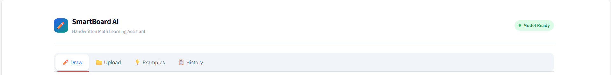
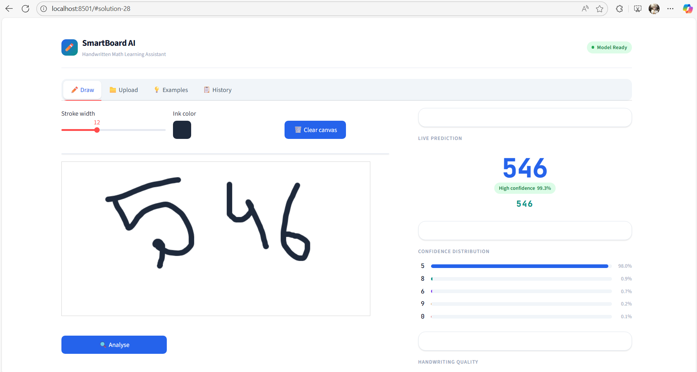
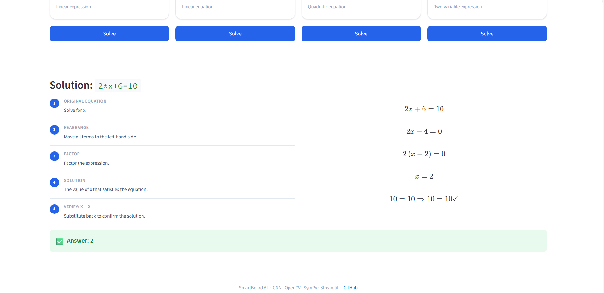
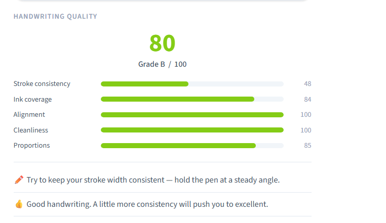
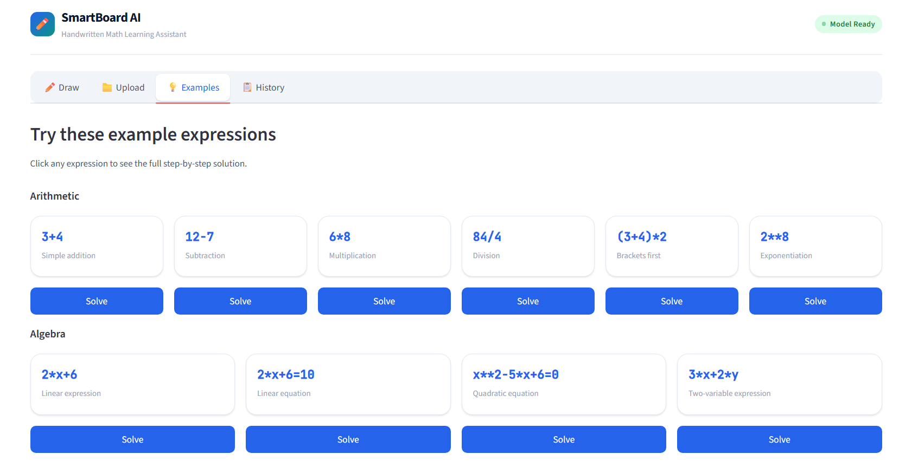
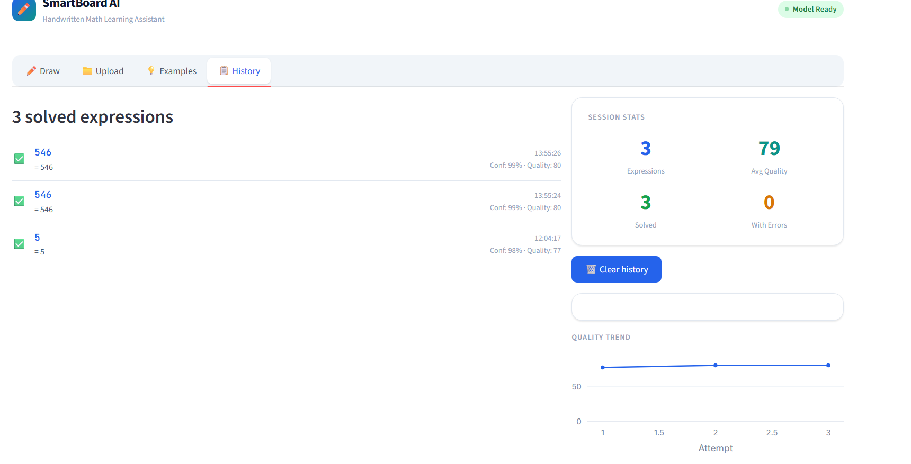

# ✏️ SmartBoard AI

> Handwritten Math Learning Assistant — draw digits and equations, get instant CNN recognition, step-by-step solutions, and handwriting quality feedback.

[](https://python.org)
[](https://streamlit.io)
[](https://tensorflow.org)
[](https://opencv.org)
[](https://sympy.org)
[](LICENSE)

---



---

## What's Built

| Feature | Status |
|---------|--------|
| Free-draw canvas with stroke controls | ✅ |
| CNN digit recognition (~99.3% accuracy on MNIST) | ✅ |
| Multi-digit segmentation via OpenCV contours | ✅ |
| Confidence visualization — top-5 bars + confidence pill | ✅ |
| SymPy step-by-step solver with LaTeX rendering | ✅ |
| Handwriting quality score 0–100 with tips | ✅ |
| Upload image tab | ✅ |
| Examples tab with one-click solving | ✅ |
| Session history with Plotly trend chart | ✅ |
| Streamlit Cloud deployment with Python 3.11 pinned | ✅ |

---

## Screenshots

### ✏️ Draw — Live Canvas + Sidebar

Draw any digit or arithmetic expression. Click **Analyse** to run the full pipeline.



---

### 🧮 Step-by-Step Solution

Recognised expressions are parsed by SymPy. Each solve step is numbered and rendered in LaTeX alongside a plain-English explanation.



---

### ✍️ Handwriting Quality Score

Five CV metrics combined into a 0–100 score with grade and actionable tips.



---

### 💡 Examples Tab

Pre-loaded arithmetic and algebra expressions. Click **Solve** on any card to see the full step-by-step solution — no drawing needed.



---

### 📋 History Tab

Every solved expression is logged with confidence, quality score, and timestamp. A live Plotly chart shows your quality trend across the session.



---

## How It Works

```
You draw on canvas
        │
        ▼
  preprocess.py  ── Greyscale → Adaptive Threshold → Morphological Close
        │
        ▼
  Contour detection → Filter noise → Merge nearby boxes → Sort left-to-right
        │
        ▼
  28×28 MNIST-normalised patches
        │
        ▼
  model.py  ── CNN predicts each patch → top-5 confidence scores
        │
        ├──────────────────────────────┐
        ▼                              ▼
  solver.py                      quality.py
  SymPy parses expression         5 CV metrics → 0–100 score
  → step-by-step LaTeX            → grade + tips
```

---

## CNN Architecture

Trained on MNIST — 60,000 samples, ~99.3% test accuracy.

| Layer | Detail |
|-------|--------|
| Input | 28 × 28 × 1 greyscale |
| Conv Block 1 | Conv2D(32) × 2 + BatchNorm + MaxPool + Dropout(0.25) |
| Conv Block 2 | Conv2D(64) × 2 + BatchNorm + MaxPool + Dropout(0.25) |
| Conv Block 3 | Conv2D(128) + BatchNorm + Dropout(0.25) |
| Head | GlobalAvgPool → Dense(256) → Softmax(10) |

Optimiser: Adam with `ReduceLROnPlateau` + `EarlyStopping`. Model saved to `smartboard_model.h5` after first run.

---

## Handwriting Quality Metrics

| Metric | How it's measured | Weight |
|--------|-------------------|--------|
| Stroke consistency | Coefficient of variation of distance transform across ink pixels | 30% |
| Ink coverage | Ink pixel density — penalises too faint or too smudged | 20% |
| Alignment | Hough line confidence as a baseline regularity proxy | 15% |
| Cleanliness | Count of small disconnected noise components | 25% |
| Proportions | Bounding box aspect ratio check | 10% |

---

## Project Structure

```
smartboard_ai/
├── app.py                  # Streamlit UI — Draw, Upload, Examples, History tabs
├── model.py                # CNN build, train, load, and inference
├── preprocess.py           # OpenCV segmentation pipeline
├── solver.py               # SymPy parser and step-by-step solver
├── quality.py              # CV-based handwriting quality scorer
├── requirements.txt        # Python dependencies
├── .python-version         # Pins Python 3.11 for Streamlit Cloud
└── smartboard_model.h5     # Auto-generated on first run
```

---

## Running Locally

```bash
git clone https://github.com/your-username/smartboard-ai.git
cd smartboard-ai

python -m venv .venv
source .venv/bin/activate        # Windows: .venv\Scripts\activate
pip install -r requirements.txt
streamlit run app.py
```

First launch trains the CNN (~2 min on CPU) and saves `smartboard_model.h5`. Every launch after is instant.

---

## License

MIT — free to use, modify, and deploy.
